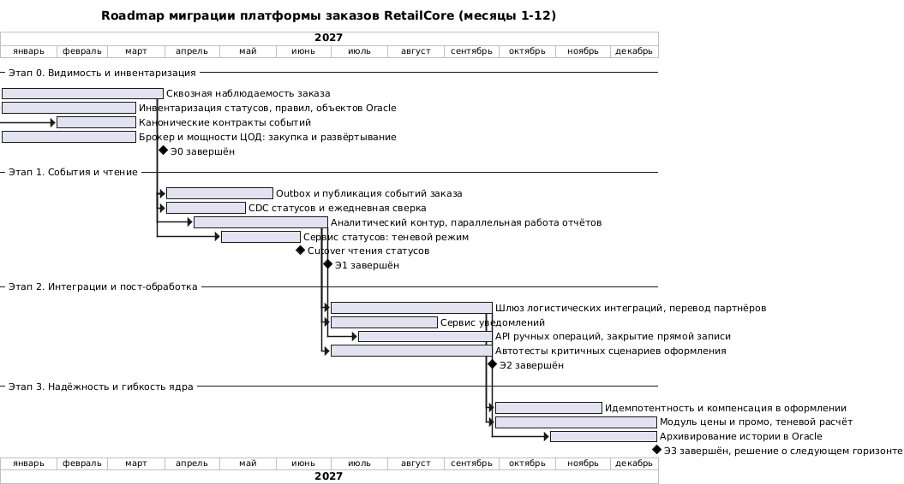

# Roadmap миграции платформы заказов RetailCore

Oct 1, 2026 · @Alexander Fedorov

## 1. Назначение и правила управления

Миграция идёт 12 месяцев в четыре этапа, и после каждого этапа платформа находится в рабочем устойчивом состоянии: если программу остановить, система останется работоспособной и более прозрачной, чем до начала. Приём заказов не останавливается ни на одном шаге.

Документ раскладывает точки трансформации по времени: состав работ каждого этапа, промежуточное состояние системы, зависимости, риски и критерии завершения.

Правила управления миграцией:

1. Этап завершается по критериям, а не по дате. Решение о переходе принимает архитектурный комитет с участием спонсора.
2. Каждое переключение на промышленной среде выполняется по своему cutover plan с описанным rollback.
3. Старый путь выводится из эксплуатации не раньше чем через один пиковый период или четыре недели стабильной работы нового, смотря что наступит позже.
4. В периоды сезонных пиков и крупных кампаний переключения запрещены; разработка и теневые прогоны продолжаются.
5. На трансформацию выделяется фиксированная доля ёмкости команд, остальная — на коммерческие сценарии; долю утверждает спонсор.
6. Архитектурные решения, меняющие границы или контракты, фиксируются в ADR.

Сроки ниже ориентировочные и отсчитываются от старта программы (месяц 1).

## 2. Обзор roadmap

Первое переключение на промышленной среде — чтение статусов заказа — приходится на месяц 6; критичный контур оформления и цены затрагивается только в месяцах 10–12. Дата старта на диаграмме условная (январь 2027) и нужна только для построения шкалы.

## 3. Этапы миграции

### 3.1. Этап 0. Видимость и инвентаризация (месяцы 1–3)

| Раздел | Описание |
| --- | --- |
| Цель | Увидеть фактическое поведение системы и зафиксировать базовые метрики, ничего не меняя в логике заказа |
| Состав работ | Сквозной идентификатор заказа и корреляции в монолите, .NET, Python и сообщениях; метрики оформления и внешних вызовов; каталог фактических статусов и переходов; каталог правил цены, промо и маршрутов; реестр объектов Oracle и их потребителей; канонические контракты событий заказа; закупка и развёртывание брокера и мощностей под новые компоненты; календарь пиков и запретов на переключения |
| Промежуточное состояние | Архитектура как в AS-IS; добавлена платформа наблюдаемости, развёрнут брокер без промышленной нагрузки |
| Зависимости | Интервью с техническим лидером, руководителем заказов и эксплуатацией; согласование с ИБ маскирования персональных данных в логах; бюджет на инфраструктуру |
| Риски | Затяжка закупки сдвигает этап 1; инвентаризация окажется неполной из-за знаний у отдельных людей; логирование добавит нагрузки на монолит |
| Критерии завершения | Путь любого заказа виден по номеру; измерены p95/p99 оформления, пиковая нагрузка, доля ручного разбора и сбоев внешних вызовов; каталоги и контракты согласованы; брокер готов к нагрузке; базовые значения бизнес-метрик утверждены спонсором |

### 3.2. Этап 1. События и чтение (месяцы 4–6)

| Раздел | Описание |
| --- | --- |
| Цель | Дать единый поток событий заказа и вынести на него читающие контуры: аналитику и статусы |
| Состав работ | Transactional outbox и публикация событий из всех мест смены состояния в коде; CDC таблицы статусов для изменений из batch, админки и PL/SQL; ежедневная сверка событий с Oracle; аналитический контур и хранилище с переводом отчётов по одному; сервис статусов в теневом режиме; API Gateway; cutover чтения статусов |
| Промежуточное состояние | Монолит публикует события; старые выгрузки и прямые запросы аналитики работают параллельно с новым контуром; чтение статусов идёт через API Gateway в сервис статусов с возможностью вернуть маршрут на монолит |
| Зависимости | Критерии этапа 0; согласование определений показателей с финансами и маркетингом; допустимая задержка статуса от руководителя заказов |
| Риски | Часть смен статуса не попадёт в события; outbox добавит запись в Oracle; расхождение новых и старых отчётов подорвёт доверие бизнеса |
| Критерии завершения | Сверка событий с Oracle без расхождений две недели подряд; время оформления не ухудшилось относительно базового; ключевые отчёты строятся из аналитического хранилища; cutover чтения статусов выполнен и прошёл период наблюдения |

### 3.3. Этап 2. Интеграции и пост-обработка (месяцы 7–9)

| Раздел | Описание |
| --- | --- |
| Цель | Снять интеграции через таблицы Oracle и ручные правки в обход правил, вынести пост-обработку и подготовить ядро к защитным доработкам |
| Состав работ | Шлюз логистических интеграций на основе .NET-сервиса и перевод партнёров по одному; сервис уведомлений с переводом по типам; API ручных операций и перевод админки, закрытие прямой записи в Oracle; автотесты критичных сценариев оформления; вывод старых аналитических выгрузок |
| Промежуточное состояние | Часть партнёров работает через шлюз, часть — через старые каналы; INT\_ORDER\_EXPORT и RETRY\_DELIVERY\_QUEUE сохраняются до перевода последнего партнёра; уведомления отправляются либо монолитом, либо сервисом — никогда обоими для одного типа |
| Зависимости | Критерии этапа 1; контракт данных логистики; тестовые среды партнёров; перечень ручных операций от поддержки и операционного блока |
| Риски | Потеря или дублирование заявок при переводе партнёра; поддержка не сможет выполнить сценарий, не покрытый API; скрытые потребители выводимых таблиц |
| Критерии завершения | Все логистические партнёры на шлюзе или с утверждённым сроком перевода; дубли заявок не доходят до партнёров; прямая запись админки в Oracle закрыта правами; автотесты покрывают критичные сценарии оформления; прямые запросы BI и Python к операционной БД отключены |

### 3.4. Этап 3. Надёжность и гибкость ядра (месяцы 10–12)

| Раздел | Описание |
| --- | --- |
| Цель | Убрать причины «зависших» заказов и дублей в оформлении и дать бизнесу менять правила цены и промо без релиза монолита |
| Состав работ | Ключ идемпотентности на создание заказа; компенсация резерва при сбое оплаты; статус «ожидает оплаты»; задание-сверка зависших заказов; модуль цены и промо за единым интерфейсом с теневым расчётом и переключением по каналам; архивирование истории в Oracle |
| Промежуточное состояние | Целевое состояние горизонта: все защитные доработки за переключателями; старые механизмы цены доступны для отката до конца периода наблюдения |
| Зависимости | Автотесты этапа 2; единая модель статусов этапа 1; решение бизнеса об эталонном механизме скидки; согласование нового статуса с маркетплейсами; правила хранения данных |
| Риски | Прямое влияние на конверсию и сумму заказа; этап приходится на предновогодний пик, переключения может потребоваться перенести |
| Критерии завершения | Нет дублей заказов при повторном запросе; снижена доля заказов с списанными деньгами без подтверждения; типовая надбавка или промо-правило меняется без релиза; расхождения теневого расчёта объяснены; принято решение о следующем горизонте |

## 4. Зависимости между работами

Критический путь программы: наблюдаемость → события заказа → аналитический контур → шлюз логистики → модуль цены. Задержка любого звена сдвигает конец программы; параллельные работы имеют запас.

| № | Работа | Зависит от | Почему | На критическом пути |
| --- | --- | --- | --- | --- |
| 1 | Outbox и публикация событий | Наблюдаемость, контракты событий, брокер, каталог статусов | Нужно измерить влияние на оформление и знать все места смены состояния | Да |
| 2 | CDC статусов и сверка | Реестр объектов Oracle, брокер | Покрывает смены статуса вне кода до перевода админки на API | Нет |
| 3 | Аналитический контур | События заказа, CDC, словарь показателей | Источник данных и согласованные определения | Да |
| 4 | Сервис статусов и cutover чтения | События заказа, CDC, API Gateway, допустимая задержка статуса | Проекция должна быть полной, переключение идёт маршрутом в шлюзе | Нет |
| 5 | Шлюз логистических интеграций | События заказа, каталог правил маршрутов, тестовые среды партнёров | Входной поток и скрытые правила | Да |
| 6 | Сервис уведомлений | События заказа, сервис статусов | Текст должен совпадать с клиентским статусом | Нет |
| 7 | API ручных операций | События заказа, сервис статусов, каталог переходов | Правка проверяется по модели статусов и публикуется событием | Нет |
| 8 | Защитные доработки оформления | Автотесты, единая модель статусов, ответы платёжных интеграций | Без тестов и модели статусов изменение нельзя проверить | Нет |
| 9 | Модуль цены и промо | Каталог правил, автотесты, решение об эталонном механизме | Теневой расчёт нужно с чем-то сравнивать | Да |
| 10 | Вывод старых выгрузок и таблиц | Перевод всех потребителей, период наблюдения | Скрытые потребители проявляются только после отключения | Нет |

## 5. Реестр рисков миграции

Вероятность и влияние — экспертная оценка; реестр пересматривается на каждой точке принятия решения.

| № | Риск | Этап | Вероятность | Влияние | Предупреждение | Реакция | Владелец |
| --- | --- | --- | --- | --- | --- | --- | --- |
| 1 | Затяжка закупки брокера и мощностей ЦОД | 0 | Средняя | Высокое | Заявка в первый месяц, использование существующего брокера, если подходит | Сдвиг этапа 1, аналитический контур начинается на CDC | Эксплуатация |
| 2 | Неполная инвентаризация статусов, правил и потребителей таблиц | 0–2 | Высокая | Среднее | Интервью с носителями знаний, анализ журналов доступа к таблицам | Период наблюдения перед выводом, временное возвращение старого пути | Технический лидер |
| 3 | Outbox или CDC ухудшают время оформления | 1 | Низкая | Высокое | Нагрузочный тест, включение на части трафика | Отключение настройкой | Технический лидер |
| 4 | Расхождение новых и старых отчётов | 1 | Высокая | Среднее | Словарь показателей до начала, параллельная работа и сверка | Отчёт остаётся на старом источнике до объяснения расхождений | Аналитика |
| 5 | Потеря или дублирование заявок при переводе логистического партнёра | 2 | Средняя | Высокое | Один партнёр за раз, идемпотентность по ключу заявки, сверка | Возврат партнёра на старый канал, досылка заявок по итогам сверки | Логистика |
| 6 | Переключение не укладывается в окно между пиками | 1–3 | Средняя | Среднее | Календарь пиков на этапе 0, переключения в начале окон | Перенос переключения, а не совмещение с пиком | Спонсор |
| 7 | Изменение суммы заказа при переходе на модуль цены | 3 | Средняя | Высокое | Теневой расчёт, согласование расхождений с бизнесом | Откат переключателем, корректировка затронутых заказов | Руководитель заказов |
| 8 | Команды не успевают совмещать миграцию и коммерческие задачи | 0–3 | Высокая | Среднее | Фиксированная доля ёмкости, правило приоритизации от спонсора | Перенос некритичных работ, пересмотр сроков на точке решения | Спонсор |
| 9 | Уход носителей знаний о ядре | 0–3 | Средняя | Высокое | Каталоги и ADR как обязательный результат каждого этапа, парная работа над ядром | Пауза работ в ядре до передачи знаний | Технический лидер |
| 10 | Потеря прозрачности статусов для поддержки на переходе | 1–2 | Средняя | Высокое | Наблюдаемость как критерий приёмки каждого переключения, поддержка в числе принимающих | Возврат маршрута на монолит | Руководитель поддержки |

## 6. Метрики программы и точки принятия решений

Базовые значения метрик фиксируются на этапе 0; до этого целевые значения задаются направлением изменения, а не цифрой.

| № | Метрика | Цель бизнеса | Ожидаемое изменение | Когда виден эффект |
| --- | --- | --- | --- | --- |
| 1 | p95/p99 времени оформления заказа | Стабильность на пиках | Не хуже базового на этапах 0–2, снижение после разгрузки Oracle | Этап 2 |
| 2 | Доля заказов в ручном разборе | Меньше ручных операций | Снижение | Этапы 2–3 |
| 3 | Внутренние касания на обращение в поддержку | Прозрачность статусов | Снижение | Этап 1 |
| 4 | Доля расхождений статуса между каналами | Прозрачность статусов | Стремится к нулю | Этап 1 |
| 5 | Отчёты с разными цифрами по одному показателю | Единая картина данных | Стремится к нулю | Этап 1 |
| 6 | Дубли заявок логистическим партнёрам | Стабильность процесса | Стремится к нулю | Этап 2 |
| 7 | Заказы со списанными деньгами без подтверждения | Устойчивость оформления | Снижение | Этап 3 |
| 8 | Время от идеи до запуска типового промо или надбавки | Скорость коммерческих изменений | Снижение, без релиза монолита | Этап 3 |
| 9 | Доля интеграций через таблицы Oracle | Подготовка к отказу от Oracle | Снижение до нуля для вынесенных контуров | Этап 2 |

Точки принятия решений — конец каждого этапа. На них архитектурный комитет со спонсором проверяет критерии завершения и метрики, пересматривает реестр рисков и выбирает один из вариантов: продолжить по плану, продлить этап, изменить состав следующего этапа или остановиться на достигнутом состоянии. Бюджет следующего этапа утверждается на этой же точке.
